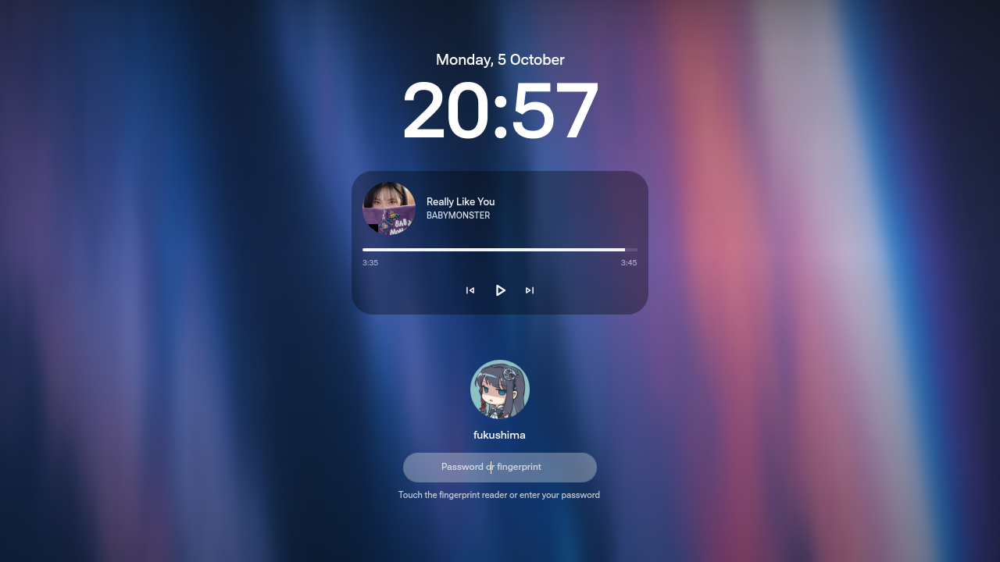

# quickshell-greetd

A theme-agnostic [greetd](https://sr.ht/~kennylevinsen/greetd/) greeter built
on [Quickshell](https://quickshell.org). Replaces SDDM, and can run an
existing Quickshell lockscreen as the login screen without editing it.



## Design

```
greetd (root, owns PAM)
  └─ quickshell-greetd-launcher      config, user/session discovery, env
       └─ cage | niri | sway         greeter compositor
            └─ quickshell            shell root = the theme's tree
                 ├─ QsGreet          auth, window, recovery   <- the core
                 └─ theme            drawing only
```

The core owns authentication, the window and recovery. A theme only draws.
That boundary is the difference from SDDM, where a theme drives the PAM
conversation itself and a broken theme leaves you with a black screen and a
TTY rescue.

Concretely:

- **Themes cannot touch greetd.** `Auth.login(user, secret)` is the entire
  surface; `respond()` is not exposed. The prompt loop lives in the core.
- **Themes do not create windows.** The core opens one, so "theme forgot to
  open a surface" cannot happen.
- **Three-way recovery.** Load error, a theme-reported `themeError`, or a
  watchdog that fires when the theme draws nothing - any of them swaps in the
  built-in login.
- **No C++ plugin API.** The contract is plain QML singletons. Quickshell's
  own `Quickshell.Services.Greetd` has not changed since it was added in
  2024-06, so there is no moving ABI underneath.
- **One config file**, projected into the environment by the launcher. The
  QML core never reads the filesystem and cannot fail to start on a bad file.

## Install

```sh
makepkg -si
```

Then point greetd at the launcher:

```toml
# /etc/greetd/config.toml
[terminal]
vt = 1

[default_session]
command = "/usr/bin/quickshell-greetd-launcher"
user = "greeter"
```

With no further configuration the greeter starts and shows its built-in
login.

## Use your own lockscreen as the login screen

```sh
qsgreet-theme-prepare ~/.config/quickshell/inir \
    --surface modules/iris/lock/IrisLockSurface.qml \
    --appearance \
    /usr/share/quickshell-greetd/themes/iris

chmod -R a+rX /usr/share/quickshell-greetd/themes/iris
echo 'QSGREET_THEME=iris' >> /etc/quickshell-greetd/config.env

# ~/.face is invisible to the greeter; use the shared store
sudo qsgreet-set-avatar ~/Pictures/me.png
```

The tool **copies** the tree - it refuses any destination inside the source,
so your live shell config is never written to. The copy is necessary because
the greeter runs as `greeter` and cannot read a mode-700 home directory.

The lock surface is loaded verbatim. It receives a `GreeterLockContext`
instead of the lockscreen's PAM-backed `LockContext`, which is why the
rendering is identical rather than reimplemented.

`--appearance` also exports the palette, wallpaper and shell config so the
colours match. That directory is world-readable, so credential-shaped config
fields are blanked and the exporter prints exactly what it redacted - shell
configs routinely hold API keys.

Fingerprint and keyring unlock are **not** done by the greeter. They belong
in `/etc/pam.d/greetd`, where greetd already runs PAM as root for the target
user, so the greeter gains no privilege; see the shipped
`pam.d-greetd.example`. Reader prompts then surface in `Auth.infoMessage`.

What stays degraded: the media card, notifications and weather. Nobody is
logged in yet, so there is no session bus to read, and reaching into a
logged-out user's `/run/user/<uid>/bus` would be a hole, not a feature. See
[docs/THEME_CONTRACT.md](docs/THEME_CONTRACT.md) for the full table.

## Configuration

`/etc/quickshell-greetd/config.env`, a plain shell fragment. Environment set
by greetd always wins.

| Key | Default | Meaning |
|---|---|---|
| `QSGREET_THEME` | `fallback` | Theme directory name, or `fallback` for the built-in login |
| `QSGREET_USER` | autodetected | Log straight in as this user; autodetected when there is exactly one regular account |
| `QSGREET_LOCK_USER` | `1` | Hide the user picker |
| `QSGREET_COMPOSITOR` | `cage` | `cage`, `niri` or `sway` |
| `QSGREET_WINDOW_MODE` | per compositor | `floating` or `layer` |
| `QSGREET_SURFACE` | from `theme.env` | Lock surface path inside the theme tree |
| `QSGREET_THEME_WATCHDOG` | `6` | Seconds before a silent theme is replaced; `0` disables |
| `QSGREET_DEFAULT_COMMAND` | `[]` | JSON array used when no desktop file is selected |
| `QSGREET_POWER_ENABLED` | `1` | Allow power actions |
| `QSGREET_FINGERPRINT` | autodetected | Set from `pam_fprintd` in the greetd PAM stack; tells themes to offer the affordance |
| `QSGREET_AVATAR_STORE` | `/var/cache/quickshell-greetd/avatars` | Where `qsgreet-set-avatar` writes |

## Compositor choice

cage does not implement `wlr-layer-shell`, so the greeter uses a single
fullscreen toplevel there - correct, since cage is single-output and
fullscreens its only client. niri and sway do implement it, which gives one
layer surface per output and proper multi-monitor behaviour. Set
`QSGREET_COMPOSITOR=niri` and provide `/etc/quickshell-greetd/niri.kdl`.

## Writing a theme

See [docs/THEME_CONTRACT.md](docs/THEME_CONTRACT.md).

## License

MIT.
